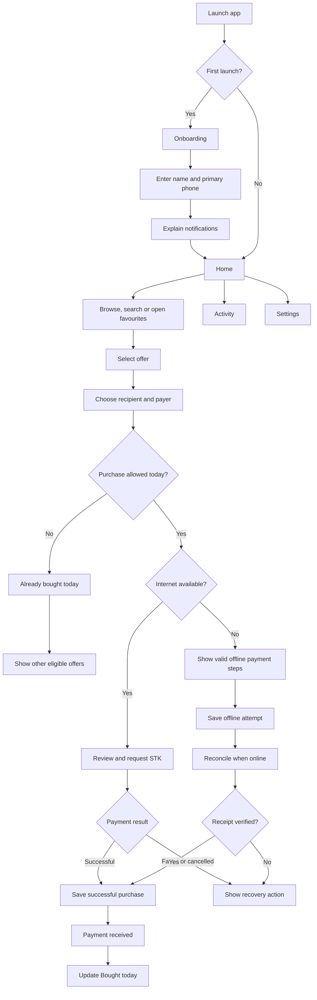
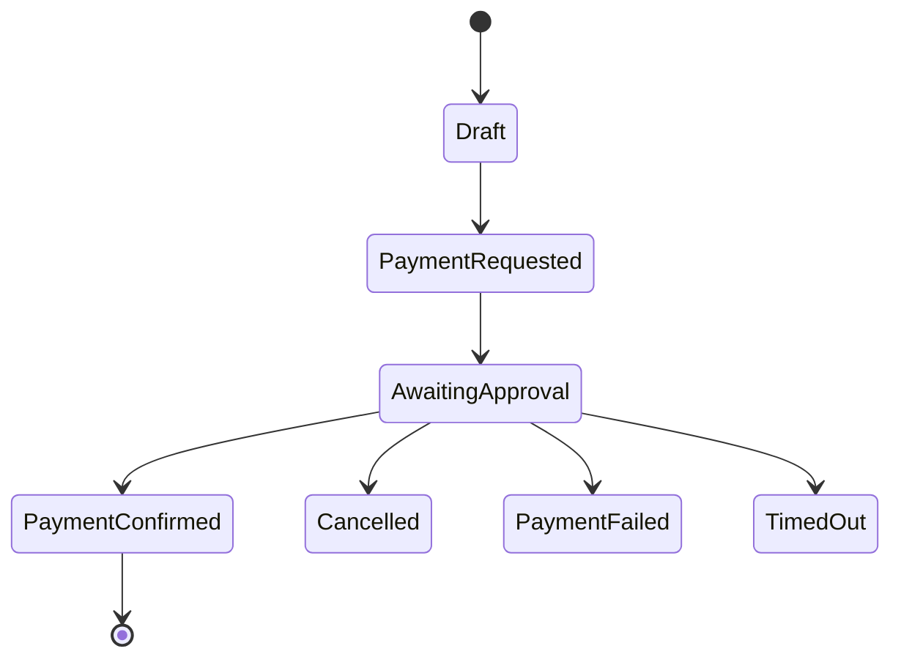
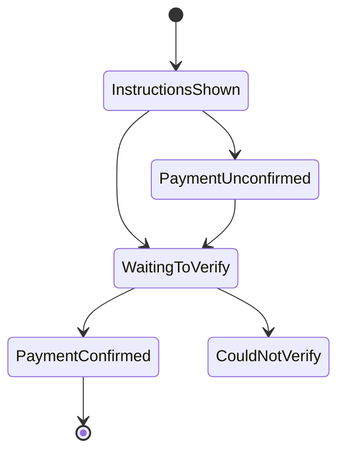

# Skylink Bingwa Customer App — Plan

**Product:** Skylink Bingwa  
**Platform:** Native Android  
**Status:** Pre-build product and experience specification  
**Design direction:** Calm Momentum  
**Primary goal:** Let a customer find and buy the right Bingwa offer with almost no hesitation.

---

## 1. Product Definition

Skylink Bingwa is a customer-facing Android store for purchasing Bingwa data, SMS, minutes and special offers from one business.

It is not:

- An agent marketplace.
- An admin dashboard.
- A bundle-fulfilment application.
- A customer-account platform in version 1.
- A rewards or referral platform in version 1.
- A mobile-data usage tracker.
- A system that recommends bundle sizes from the customer’s data consumption.

The USSD automation and fulfilment system run on the owner’s agent phone. The customer app only needs a secure backend contract for the offer catalogue, M-Pesa STK initiation and payment outcome.

In version 1, the customer app does not verify whether the bundle reached the recipient. After a successful payment, it records **Payment received** and tells the customer to wait for the bundle. Delivery verification may be added in a later version.

### Product promise

> Find an offer, buy online or offline, and know exactly what is happening.

### What “powerful” should mean

- Fast on low-cost Android phones.
- Clear even for a first-time customer.
- Reliable when M-Pesa is delayed or interrupted.
- Able to recover an interrupted purchase.
- Usable when the customer has no internet connection.
- Easy to search, filter, favourite and buy again.
- Aware of offers the customer has already paid for that day.
- Calm and visually polished without unnecessary effects.

The app should not chase a “crazy” experience through excessive animation, 3D graphics or crowded features. Its memorable quality should be speed, certainty and control.

---

## 2. Locked Version 1 Decisions

| Area | Decision |
|---|---|
| Seller | Only the Skylink Bingwa business |
| Audience | Customers buying Bingwa offers |
| Platform | Android only |
| Accounts | No account required |
| Local profile | Name and primary phone collected during first-launch onboarding |
| Catalogue | Offline-first local catalogue refreshed from the backend |
| Online payment | M-Pesa STK Push |
| Offline payment | Till for own-number purchases; Paybill plus recipient account for buy-for-another |
| Recipient | Customer can buy for self or another number |
| Payer | Buyer’s chosen M-Pesa number receives the STK Push |
| History | Stored locally on the device |
| Purchase awareness | Shows offers successfully paid for today and applies per-offer daily purchase policies |
| Data recommendations | None; the app only displays offers and purchase-aware eligibility guidance |
| Core extras | Search, filters, favourites, quick rebuy, promotions, online and offline notifications, and support |
| Settings | Name, primary phone, notification controls, appearance, About and app version |
| Rewards | Excluded from version 1 |
| Future loyalty | Server-controlled credits/tokens in a later version |
| Distribution | Google Play Store and direct APK |
| Themes | Light and dark, following the system by default |
| Visual rules | Poppins, no gradients, no emojis, one outlined icon family |

---

## 3. Experience Principles

### 3.1 One decision at a time

Do not put catalogue selection, recipient entry, payer entry and payment confirmation into one dense screen.

### 3.2 Never confuse payer and recipient

The interface must always use these exact concepts:

- **Bundle recipient:** receives the bundle.
- **M-Pesa payment number:** receives and approves the STK Push.

Avoid “phone number” on its own.

### 3.3 Stop at the app’s true responsibility

The customer app confirms payment only. It must not display **Bundle delivered**, poll for delivery, ask the customer to verify delivery or invent a delivery state.

After successful payment, show:

**Payment received**

Your purchase was received. Please wait for the bundle on {recipientNumber}.

The agent phone and automation handle everything after that point.

### 3.4 Preserve progress

If the app is closed during payment, reopening it must restore the active order and continue checking until payment succeeds, fails, is cancelled or expires.

### 3.5 Make recovery obvious

Every delayed or failed state must explain:

- Whether money was deducted.
- What the customer should do next.
- How to contact support with the order reference.

### 3.6 Ask for permissions in context

Do not ask for notification permission on first launch. Explain its value after the first successful purchase or when the customer explicitly enables deal alerts.

### 3.7 Offline means useful, not frozen

The app must not replace its interface with a full-screen offline error. Home, Offers, search, filters, favourites, activity and offline-eligible purchase instructions must continue to work from local data.

Use a small connection-status message only when it changes what the customer can do:

- **Offline — you can still buy using M-Pesa**
- **Back online — offers updated**

Do not repeatedly announce normal connectivity changes.

### 3.8 Engagement must not become notification spam

Notifications should bring the customer back for a clear reason, not merely remind them that the app exists. Transactional messages are always higher priority than promotions.

Marketing and reminder notifications must:

- Be optional.
- Respect quiet hours.
- Share one frequency cap across remote and local notifications.
- Avoid repeating an offer the customer just ignored.
- Stop after repeated non-engagement.

---

## 4. Information Architecture

Use four bottom-navigation destinations:

1. **Home**
2. **Offers**
3. **Activity**
4. **Help**

The labels must remain visible. Do not use icon-only navigation.

### Global destinations

- Search
- Notifications
- Favourites
- Purchase flow
- Active-order status
- Purchase details
- Theme and notification settings
- Privacy, terms and app information

### Why “Activity,” not “History”

Activity can contain completed, pending, delayed and failed purchases. “History” implies only finished records.

### Complete app flow



### Flow rules

- Onboarding is functional setup, not a marketing carousel.
- The saved primary phone pre-fills both recipient and M-Pesa payment number, but either may be changed during checkout.
- The daily-purchase check is based on the selected offer and recipient number.
- Online checkout asks the backend whether a hard-limited offer is eligible before requesting STK.
- Offline checkout uses local successful-payment history and the cached offer policy.
- The app stops at **Payment received**. It does not track bundle delivery in version 1.
- “Show other eligible offers” means listing offers that can still be purchased; it is not a data-consumption recommendation.

---

## 5. Screen Plan

### 5.1 Launch and first use

Use the Android splash screen with only the adaptive logo mark. Do not add a second custom splash page.

On first open, run a short functional onboarding:

1. **Welcome**
   - One sentence explaining that Skylink Bingwa is for buying data, SMS, minutes and special offers.
2. **Your details**
   - Name.
   - Primary Safaricom phone number.
3. **Useful notifications**
   - Explain payment updates, saved-offer reminders and meaningful purchase-based messages.
   - Let the customer choose whether to enable notifications.
4. **Continue to Home**

Onboarding rules:

- Name and primary phone are required, but this does not create an account.
- No OTP is required in version 1.
- Validate and normalize the Kenyan phone number.
- Store the name and number locally using Keystore-backed protection.
- Use the primary phone as the default recipient and M-Pesa payment number.
- Let the customer edit both defaults later in Settings.
- Request Android notification permission only after the customer accepts the in-app explanation.
- If notification permission is denied, complete onboarding normally.
- Do not use promotional slides, feature tours or forced sign-in.

### 5.2 Home

Order of content:

1. Compact brand header.
2. Search field: **Search data, SMS or minutes**
3. Category shortcuts: Data, Minutes, SMS, Special offers.
4. One restrained promotion area.
5. **Popular offers**
6. **Bought today** when successful purchases exist for the current day.
7. **More offers you can buy** when a once-per-day offer has already been used.
8. **Buy again** for repeatable offers.
9. **Your favourites** when favourites exist.

Rules:

- No auto-rotating promotional carousel.
- No more than one large promotion above the fold.
- Keep the first useful offers visible without excessive scrolling.
- A notification bell may appear in the header.
- Render the Home catalogue from Room immediately, then refresh it in the background when online.
- When offline, show a compact status strip and keep the catalogue usable.
- Never replace Home with a full-screen offline page.
- Address the customer by first name only where it feels natural; do not repeat the name across every section.
- “Bought today” is based on successful payments recorded by this installation.
- Never claim to know how much mobile data the customer has left.

### 5.3 Offers

Content:

- Search.
- Category tabs or chips.
- Filters.
- Sort.
- Offer results.

Version 1 filters:

- Category.
- Price range.
- Validity.

Version 1 sorting:

- Popular.
- Lowest price.
- Highest value.
- Shortest validity.
- Longest validity.

Offer cards show:

- Main allowance: for example, **1.5 GB**.
- Price: **KSh 50**.
- Validity: **3 hours**.
- At most one label: Popular, Best value or Limited offer.
- Favourite control.
- Clear selectable area.
- Offline availability when the device is disconnected.
- Daily purchase state when applicable.

Daily state labels:

- **Available today**
- **Bought today**
- **Available again tomorrow**
- **{n} purchases left today**

Do not label ordinary offers as “recommended.” The app may show Popular, Best value or More offers, but it does not calculate what data allowance the customer needs.

Do not put a full-size button on every compact offer card. Selecting the card opens offer details or the purchase action sheet.

When offline:

- Show only valid cached data.
- Mark offers that cannot be bought offline.
- Hide or disable expired offline prices.
- Do not imply that a cached price is current when its offline-validity window has ended.

### 5.4 Offer details

Use a bottom sheet for short offers and a page only when an offer has substantial rules.

Show:

- Allowance.
- Price.
- Validity.
- Important eligibility or timing rules.
- Recipient compatibility, if relevant.
- Primary action: **Buy bundle**.
- Favourite action.

### 5.5 Recipient and payer

Step 1: choose:

- **For my number**
- **For another number**

Step 2: enter or confirm the bundle recipient.

Step 3: enter or confirm the M-Pesa payment number.

Useful behaviour:

- Remember recently used numbers locally.
- Offer a contact picker only after the user chooses it.
- Normalize `07...`, `01...`, `254...` and `+254...` into E.164 format.
- Display Kenyan numbers in a familiar grouped format.
- Do not request broad contacts permission merely to choose one contact.
- Do not attempt to silently read the device phone number; it is unreliable and creates unnecessary permission friction.

### 5.6 Review purchase

This is the last screen before online STK initiation or offline payment instructions.

Display:

| Field | Required presentation |
|---|---|
| Offer | High emphasis |
| Bundle recipient | Full, readable and clearly labelled |
| M-Pesa payment number | Full, readable and clearly labelled |
| Total | Highest emphasis |

Primary action when online:

**Pay KSh {amount}**

Primary action when offline and the offer is eligible:

**View offline payment steps**

Secondary action:

**Change details**

Do not use a vague button such as Proceed or Submit.

### 5.7 STK and processing

After the request is accepted:

- Show the exact M-Pesa number receiving the prompt.
- Tell the user to check the phone and enter their M-Pesa PIN.
- Provide **Resend prompt** only after a controlled delay.
- Provide **Change payment number** before payment is confirmed.
- Continue status checks if the user leaves and returns.
- Never show a fake progress percentage.

### 5.8 Offline purchase flow

Offline purchasing means the app presents locally stored M-Pesa payment instructions. It does not mean the app can contact Daraja, confirm payment or confirm delivery without internet.

#### Eligibility rules

An offer may be purchased offline only when:

- It is marked `offlineEligible`.
- Its cached offline price has not expired.
- The cached Till or Paybill configuration has not expired.
- Its payable amount uniquely identifies the offer on the selected payment route.

If two offline offers use the same exact amount on the same route, the fulfilment system cannot reliably know which offer was selected. One of those offers must use a different amount, a different account-reference format, or be disabled for offline purchase.

#### For my number

Show:

1. **Go to M-Pesa**
2. Choose **Lipa na M-Pesa**
3. Choose **Buy Goods and Services**
4. Enter Till number **{configuredTillNumber}**
5. Enter the exact amount **KSh {amount}**
6. Complete payment using the same number that should receive the bundle

The Till route can only support own-number delivery because the payment sender becomes the recipient identity.

#### For another number

Show:

1. **Go to M-Pesa**
2. Choose **Lipa na M-Pesa**
3. Choose **Pay Bill**
4. Enter business number **{configuredPaybillNumber}**
5. Enter the bundle recipient as the account number
6. Enter the exact amount **KSh {amount}**
7. Complete payment from the buyer’s M-Pesa number

The app must normalize and display the account number before the customer leaves the screen.

#### Instruction-screen UX

The screen must provide:

- Copy Till or Paybill number.
- Copy amount.
- Copy recipient account.
- A clear distinction between Till and Paybill.
- A warning not to change the amount.
- A warning to verify the number before paying.
- A locally saved timestamp and selected offer.
- **I’ve paid** and **Cancel offline purchase** actions.

After **I’ve paid**:

- Ask the customer to enter or paste the M-Pesa receipt code.
- Store the attempt locally as **Waiting to verify**.
- Do not claim that payment or delivery succeeded.
- When connectivity returns, submit the receipt and offline-purchase details for server verification.

If the customer does not enter a receipt, retain the attempt as **Payment not confirmed** and provide a later **Check purchase** action.

#### Offline catalogue safety

The app should ship with a small fallback catalogue, but the backend-refreshed local catalogue remains the normal source.

Each offline offer record must contain:

- Offer ID.
- Display name.
- Allowance.
- Validity.
- Offline price.
- Payment route.
- Offline eligibility.
- Catalogue version.
- `validFrom`.
- `validUntil`.
- A server signature.

The app contains only the public verification key. The backend signs offline catalogue data with its private key so a modified local catalogue cannot create trusted payment instructions.

No offline catalogue can remain safe forever. If prices or payment numbers may change, the cached rules must expire. The app can remain browsable after expiry, but it must not present an outdated amount as safe to pay.

### 5.9 Success

The final positive state in version 1 is:

**Payment received**

The final screen shows:

- Purchased offer.
- Recipient number.
- Amount paid.
- M-Pesa receipt when available.
- Skylink Bingwa order reference.
- Time.
- A simple message asking the customer to wait for the bundle.
- **Buy again**
- **View more offers**
- **Back to home**

If the offer is limited to one purchase per day, replace **Buy again** with:

**View other offers**

Use a restrained one-time check animation and light haptic feedback. No confetti. Do not show a later delivery-progress screen in version 1.

### 5.10 Activity

Use compact rows, not large cards.

Each row shows:

- Offer.
- Recipient.
- Amount.
- Date and time.
- Status.

Purchase details must clearly state that history belongs to this installation and may be lost if app data is cleared or the app is reinstalled.

Offline attempts must use distinct states:

- Payment instructions shown.
- Payment not confirmed.
- Waiting to verify.
- Payment received.
- Could not verify.

### 5.11 Favourites and quick rebuy

Favourites are stored locally.

Quick rebuy must:

- Re-open the latest locally stored version of the offer.
- Revalidate the price and availability online before STK purchase.
- Validate the signed offline price and validity window before offline purchase.
- Never silently reuse an old price.
- Prefill the last recipient and payer but allow both to be changed.

### 5.12 Daily purchase awareness

The app must know which offers were successfully paid for today through the current installation.

This feature is not a bundle recommendation engine. It does not inspect data usage, remaining balance, browsing behaviour outside the app or device network consumption.

It only uses:

- Successful Skylink Bingwa payments.
- Offer purchase policy.
- Recipient number.
- Current day in `Africa/Nairobi`.

Each offer has one of these policies:

```text
MULTIPLE_PER_DAY
ONCE_PER_RECIPIENT_PER_DAY
MAX_PER_RECIPIENT_PER_DAY
```

For `MAX_PER_RECIPIENT_PER_DAY`, the offer also contains `maxPurchasesPerDay`.

#### Behaviour

- A successful payment immediately updates the local **Bought today** record.
- An unverified offline attempt shows **Waiting to verify** and temporarily prevents another tap on the same hard-limited offer from this installation.
- Limits apply per recipient number, not merely per payer or app installation.
- Repeatable offers keep **Buy again** available.
- Once-per-day offers show **Bought today** and disable another purchase for that recipient.
- The app shows other eligible offers without claiming they are personalised data recommendations.
- The daily window resets at midnight in `Africa/Nairobi`.

#### Online accuracy

Before STK initiation, the backend performs an eligibility check using:

- Offer ID.
- Recipient number.
- Offer policy.
- Successful payments already recorded by Skylink Bingwa.

The response returns only whether the attempted purchase is allowed, the reason and the next eligible time. It must not expose a recipient’s purchase history to an unauthenticated caller.

#### Offline limitation

Offline mode can see only purchases recorded on this installation. It cannot know that the same recipient bought the offer through another phone, website, app or direct payment.

Therefore:

- Repeatable offers may remain offline-eligible.
- Hard once-per-day offers are disabled for offline payment by default.
- They may be enabled offline only if the business has a safe duplicate-payment outcome, such as an automatic alternative, reversal or refund.
- The app may still show the offer and its local **Bought today** state while offline.

This prevents the customer from paying for an offer the automation cannot fulfil twice.

### 5.13 Promotions and notifications

Promotions:

- Come from the backend.
- Have start and end times.
- Link to a valid offer or filtered offer list.
- Do not interrupt payment screens.
- Do not auto-rotate.

Notification channels:

- Order updates.
- Offers and promotions.
- Helpful reminders.
- App updates.

Order updates should be clearly separated from marketing so customers can disable promotional notifications without losing transaction updates.

#### Remote notifications

Firebase Cloud Messaging handles notifications created by the backend:

- Payment updates.
- New offers.
- Limited promotions.
- Important service notices.
- Available app updates.

Remote notifications require connectivity. If the device is offline, FCM may hold a message and deliver it after reconnection according to its time-to-live; it does not deliver through the internet while the device is disconnected.

Use:

- Short TTLs for offers that expire soon.
- Collapsible campaign keys so only the newest version of a repeated promotion is delivered.
- High priority only for genuinely time-sensitive, user-visible transaction updates.
- Normal priority for marketing and app news.

#### Local offline notifications

The app should include approved notification templates and schedule them locally with WorkManager. These notifications can appear without internet because their content and schedule already exist on the device.

Example templates:

- **No internet? You can still buy a bundle using M-Pesa.**
- **Your favourite offers are saved and ready.**
- **Need data today? Open Skylink Bingwa to see your saved offers.**
- **Buy for another number even when you are offline.**

Do not send a notification every time connectivity is lost. Android does not guarantee immediate background execution for every network change, and such alerts would become irritating. At notification time, the worker may choose an online or offline version of the template based on current connectivity.

WorkManager timing is inexact. It is suitable for flexible engagement reminders, not a promise to notify at an exact second.

#### Notification controls

Default rules:

- Transactional updates: event-driven and not included in marketing caps.
- Marketing plus local engagement reminders: maximum two per seven days.
- Minimum 48 hours between marketing notifications.
- Quiet hours: 8:00 PM–8:00 AM local time.
- Pause reminders after three consecutive notifications with no open.
- Never send a reminder within 24 hours after a completed purchase.
- Deduplicate local and remote campaigns using a shared `campaignId`.

Settings must allow customers to control:

- Order updates.
- Offers and promotions.
- Helpful reminders.
- Personalised purchase messages.
- App updates.

#### Personalised notification engine

The notification engine uses first-party information only:

- Customer first name.
- Primary phone number as a local default, never as notification text.
- Offers successfully paid for.
- Once-per-day and repeatable purchase policies.
- Favourites.
- Last app open.
- Last completed payment.
- Notification opens and dismissals where Android exposes them.
- Current connectivity and locally cached offers.

It must not use or claim access to:

- Remaining mobile data.
- Device internet consumption.
- Other apps.
- Browsing history.
- Safaricom balance.
- Purchases not recorded by Skylink Bingwa.

#### Personalisation model

Keep the customer name locally by default. A remote campaign should send a campaign type and offer reference; the app renders the final text using the local profile and purchase history.

This allows:

- Personalised notifications without sending the customer’s name in every campaign request.
- The same rule engine to work online and offline.
- Local enforcement of quiet hours and frequency caps.
- Deduplication between remote and scheduled messages.

#### Meaningful notification groups

**Transactional**

- Payment received.
- Payment failed or cancelled.
- Offline payment waiting for verification.
- Offline receipt could not be verified.

**Purchase-aware**

- A frequently purchased repeatable offer is still available.
- A once-per-day offer becomes available again on a later day.
- The customer bought a once-per-day offer and can view other eligible offers.
- A favourite offer is still active.

**Lifecycle**

- A genuinely new offer is available.
- An app update contains a useful customer-facing improvement.
- A customer who has not opened the app recently may receive one restrained reminder.

#### Example messages

- **{firstName}, your payment was received. Please wait for the bundle on {maskedRecipient}.**
- **You bought {offerName} today. View other offers you can still buy.**
- **{offerName} is available again today.**
- **No internet? Your saved offers are still available in Skylink Bingwa.**
- **One of your favourite offers is still available.**

Do not place a full phone number, M-Pesa receipt or sensitive payment detail on the lock screen.

#### Decision and suppression order

Before showing a personalised notification:

1. Check Android permission and the relevant channel.
2. Check quiet hours.
3. Check the shared marketing frequency cap.
4. Suppress it after a recent successful payment unless it is transactional.
5. Suppress it if the referenced offer is expired or unavailable.
6. Suppress it if the once-per-day offer was already bought today.
7. Suppress duplicates using `campaignId`.
8. Choose the online or offline-safe message.
9. Record delivery and engagement locally.

The engine should prefer silence over a weak message.

### 5.14 Help

Include:

- Searchable FAQ.
- WhatsApp support.
- Call support, if available.
- Report a purchase problem.
- Privacy policy.
- Terms.
- App version.

When support is opened from a purchase, prefill:

- Order reference.
- Current status.
- Date.

Do not prefill or transmit an M-Pesa PIN or other secret.

### 5.15 Settings

Settings contains:

#### Profile

- Customer name.
- Primary Safaricom phone number.
- Edit and save actions.

Changing the primary number:

- Updates the default recipient and M-Pesa payment number.
- Does not rewrite past Activity records.
- Does not create or migrate an account.

#### Notifications

- Order updates.
- Offers and promotions.
- Helpful reminders.
- Personalised purchase messages.
- App updates.
- Link to Android system notification settings.

#### Appearance

- System default.
- Light.
- Dark.

#### About

- Skylink Bingwa description.
- App version name.
- Version code where useful for support.
- Privacy policy.
- Terms.
- Contact support.

#### Local data

- Explain that profile, favourites and Activity belong to this installation.
- Provide a carefully confirmed **Clear local data** action.

---

## 6. Transaction State Model

The customer experience depends on a correct state machine.



Offline purchases use a separate device-first state path:



### Customer copy by state

| State | Heading | Important explanation |
|---|---|---|
| Payment requested | Check your phone | Approve the M-Pesa request on the payment number |
| Awaiting approval | Waiting for payment | No payment confirmation has been received yet |
| Payment confirmed | Payment received | The purchase was received; ask the customer to wait for the bundle |
| Cancelled | Payment cancelled | The M-Pesa request was cancelled |
| Payment failed | Payment failed | Explain whether money was deducted |
| Timed out | Request expired | Let the customer resend safely |
| Instructions shown | Complete payment in M-Pesa | The app has shown the Till or Paybill steps but cannot know whether payment was made |
| Payment unconfirmed | Payment not confirmed | Enter the M-Pesa receipt when available or check again online |
| Waiting to verify | Waiting to verify | The receipt will be checked when the app has internet |
| Could not verify | We could not verify this payment | Check the receipt and payment details or contact support |

The state machine intentionally ends at `PaymentConfirmed`. Bundle fulfilment continues on the owner’s agent phone and is outside the version 1 customer-app state model.

---

## 7. Design-System Decision

Keep the **Calm Momentum** foundation. It is substantially better than the loud telecom-store style used by many competing products.

### 7.1 Required Android corrections

- Replace all layout `px` values with `dp`.
- Replace typography `px` values with `sp`.
- Remove desktop hover tokens from the Android implementation.
- Use 48dp as the minimum touch target.
- Use Material Symbols Outlined or one equivalent Android-native icon family.
- Replace the emphasized overshoot easing. It contradicts the rule against bouncing controls.
- Use Android dynamic font scaling without clipping.
- Use edge-to-edge layouts and correct system-bar insets.

### 7.2 Colour-role correction

Use:

- Green for the single primary action, selection, progress and navigation.
- Blue for information, help and low-emphasis links.
- Orange for promotions, discounts and limited-offer emphasis.

Change the current design rule that makes orange the normal **Buy bundle** button. Using green for Continue and orange for Buy creates two competing primary-action systems. For a calm utility, all primary purchase actions should remain green. Orange should signal that an offer is promotional, not that every purchase is promotional.

Recommended actions:

- **Buy bundle:** primary green.
- **Pay KSh {amount}:** primary green.
- Promotion chip or discount: orange.
- Informational link: blue.

### 7.3 Typography correction

Poppins can remain the brand typeface, but the existing 15px body size is too tight for an Android utility used on low-cost displays.

Use:

- Body default: 16sp.
- Supporting body: 14sp.
- Small labels: 12sp minimum.
- Buttons: 15–16sp, semibold.
- Prices: tabular numerals where supported.
- Font weights: 400, 500, 600 and 700 only.

Bundle only the required font weights or a well-tested variable font to control app size.

### 7.4 Shape and depth

- Moderate 12–16dp card corners.
- 12dp button/input corners.
- 24dp top corners for bottom sheets.
- Tonal surfaces before shadows.
- No nested cards unless interactions are genuinely separate.
- No pill buttons everywhere.

### 7.5 Motion

- Press feedback: 100–120ms.
- Selection changes: 160–180ms.
- Bottom sheets and page transitions: 220–260ms.
- Use standard non-overshooting easing.
- Respect reduced-motion settings.
- No looping animations, bouncing, parallax, pulsing CTAs or confetti.

---

## 8. Asset Plan

### Brand assets

- Primary logo mark.
- Horizontal wordmark.
- Light and dark logo variants.
- Monochrome logo.

### Android app assets

- Adaptive launcher icon foreground.
- Adaptive launcher icon background.
- Monochrome themed icon.
- 512×512 Play Store icon.
- Splash-screen logo mark.
- White notification status-bar icon.

### Product illustrations

Create only a small coordinated set:

- Data.
- Minutes.
- SMS.
- Special offers.
- Buy for another number.

Prefer simple vector or lightweight WebP artwork. Avoid placing a different heavy 3D image on every offer card.

### State assets

- Empty activity.
- Empty favourites.
- No search results.
- Offline.
- Payment success.
- Payment delayed.
- General error.

Most empty states should use an outlined icon rather than a large illustration.

### Store and marketing assets

- Google Play feature graphic.
- Phone screenshots.
- Short and full store descriptions.
- Privacy-policy page.
- Direct-download landing page.
- Direct APK download instructions.

---

## 9. Android Technical Stack

### Core

- Kotlin.
- Jetpack Compose with Material 3.
- Single-activity architecture.
- Navigation 3.
- ViewModel plus unidirectional data flow.
- Kotlin Coroutines and Flow.
- Hilt for dependency injection.

This follows current Android guidance for new apps: Compose, screen-level ViewModels, lifecycle-aware state collection, layered repositories and unidirectional data flow.

### Data

- Retrofit and OkHttp for HTTP.
- Kotlin serialization for payloads.
- Room as the canonical app-readable source for offers, promotions, local activity, daily purchase records, favourites, notification campaigns and queued offline purchase attempts.
- DataStore for the local profile, settings, theme and lightweight preferences.
- An offline-first repository that writes network results into Room and exposes Room data to the UI.
- WorkManager for catalogue refresh, flexible local reminders and deferred offline-purchase reconciliation.
- Connectivity monitoring as a sync signal, not as a reason to block the interface.

### Notifications and quality

- Firebase Cloud Messaging.
- Android notification channels.
- WorkManager-backed local notification scheduling.
- A local campaign ledger for frequency caps and remote/local deduplication.
- An on-device personalisation rules engine that uses the local profile and purchase history.
- Crashlytics.
- Performance Monitoring where useful.
- Analytics with a minimal, documented event schema.
- Macrobenchmark tests and Baseline Profiles.

### SDK targets

- `targetSdk`: 36 for releases submitted from 31 August 2026 onward.
- `compileSdk`: 36 or the current stable requirement at implementation time.
- `minSdk`: 24 unless device research proves Android 7 support is unnecessary.

Do not copy arbitrary dependency versions into the plan. Lock current stable versions in a version catalogue when development begins.

### Suggested modules

```text
app
core:common
core:model
core:designsystem
core:network
core:database
core:datastore
core:analytics
core:offline
core:personalization
feature:onboarding
feature:home
feature:offers
feature:checkout
feature:activity
feature:purchaseawareness
feature:favourites
feature:promotions
feature:notifications
feature:support
feature:settings
benchmark
```

Do not split every tiny class into a module. The modules should isolate real product areas and support independent testing.

---

## 10. Customer-App API Contract

The app should depend on a stable public customer API, not directly on Daraja or the USSD automation.

### Minimum endpoints

```text
GET    /v1/catalog
GET    /v1/catalog/{offerId}
GET    /v1/promotions
GET    /v1/app-config
GET    /v1/offline-config
POST   /v1/purchase-eligibility
POST   /v1/orders
GET    /v1/orders/{orderId}
POST   /v1/orders/{orderId}/resend-stk
POST   /v1/offline-purchases/reconcile
GET    /v1/offline-purchases/{verificationId}
POST   /v1/devices/push-token
DELETE /v1/devices/push-token
```

### Create-order request

```json
{
  "offerId": "offer_123",
  "recipientPhone": "+254727921038",
  "payerPhone": "+254712345678",
  "clientRequestId": "uuid-generated-on-device",
  "appVersion": "1.0.0"
}
```

### Create-order response

```json
{
  "orderId": "ord_123",
  "orderAccessToken": "unguessable-order-token",
  "status": "PAYMENT_REQUESTED",
  "offer": {
    "name": "1.5 GB",
    "priceKes": 50,
    "validityLabel": "3 hours"
  },
  "recipientPhone": "+254727921038",
  "payerPhone": "+254712345678",
  "expiresAt": "2026-07-23T13:30:00Z"
}
```

Rules:

- The server calculates the final price from `offerId`.
- The app never sends a trusted price.
- `clientRequestId` makes retries idempotent.
- The order-access token is stored only on the originating device.
- Every state includes customer-safe copy or a customer-safe error code.
- `PAYMENT_CONFIRMED` is the final customer-app success state in version 1.
- The API does not expose or require bundle-delivery status in version 1.

### Status transport

For version 1:

- Poll every few seconds while the status screen is visible.
- Back off when the app is backgrounded.
- Use FCM for payment-state notifications.
- Reconcile unfinished orders on app reopen.
- Stop status polling after payment reaches a terminal result.

WebSockets are unnecessary unless scale and latency measurements prove they are needed.

### Offer purchase policy

Every catalogue offer includes:

```json
{
  "offerId": "offer_123",
  "purchasePolicy": "ONCE_PER_RECIPIENT_PER_DAY",
  "maxPurchasesPerDay": 1,
  "policyTimezone": "Africa/Nairobi",
  "offlineEligible": false
}
```

`POST /v1/purchase-eligibility` accepts:

```json
{
  "offerId": "offer_123",
  "recipientPhone": "+254727921038",
  "installationId": "random-installation-id"
}
```

It returns:

```json
{
  "eligible": false,
  "reason": "ALREADY_BOUGHT_TODAY",
  "remainingPurchasesToday": 0,
  "nextEligibleAt": "2026-07-24T00:00:00+03:00"
}
```

The endpoint must:

- Check successful Skylink Bingwa payments, not bundle-delivery status.
- Apply limits per recipient and offer.
- Use server time in `Africa/Nairobi`.
- Return eligibility only, not private purchase-history details.
- Be rate-limited to prevent phone-number enumeration.

### Offline configuration

`GET /v1/offline-config` returns a signed and expiring payload:

```json
{
  "version": 12,
  "validFrom": "2026-07-23T00:00:00Z",
  "validUntil": "2026-08-23T00:00:00Z",
  "tillNumber": "CONFIGURED_TILL",
  "paybillNumber": "CONFIGURED_PAYBILL",
  "offers": [
    {
      "offerId": "offer_123",
      "offlinePriceKes": 50,
      "routes": ["TILL_SELF", "PAYBILL_OTHER"],
      "purchasePolicy": "MULTIPLE_PER_DAY",
      "offlineEligible": true
    }
  ],
  "signature": "base64-server-signature"
}
```

Rules:

- The app verifies the signature with an embedded public key.
- Expired payment configuration cannot initiate a new offline payment.
- The backend must reject conflicting offline amounts during catalogue publication.
- Till and Paybill values are configuration, not scattered constants.

### Offline reconciliation

The app queues a local record containing:

- Local attempt ID.
- Offer and catalogue version.
- Payment route.
- Expected amount.
- Recipient.
- Payer, when known.
- M-Pesa receipt entered by the customer.
- Local creation time.

When online, `POST /v1/offline-purchases/reconcile` sends the queued record. The server verifies the receipt against the actual C2B transaction before returning payment status.

Do not reconcile using amount and phone number alone when a receipt is available. A receipt is the strongest customer-provided correlation key and reduces false matches.

---

## 11. Security and Privacy

- Never place Daraja credentials, business secrets or automation credentials in the APK.
- Treat the app as untrusted; validate all prices, offer availability and order transitions on the server.
- Use HTTPS only and an Android network security configuration.
- Use idempotency for order creation and STK retries.
- Use idempotency for offline reconciliation.
- Rate-limit STK requests by device, payer number and order.
- Store the minimum customer data needed.
- Keep the customer name local by default.
- Send the primary phone to the backend only when required for a purchase or an explicitly documented customer operation.
- Encrypt locally retained full phone numbers and order-access tokens using Android Keystore-backed protection.
- Never log complete phone numbers, M-Pesa receipts, access tokens or payment payloads.
- Mask phone numbers in analytics and crash reports.
- Do not use certificate pinning in version 1 unless the team has a tested certificate-rotation strategy.
- Use R8 shrinking and obfuscation for release builds.
- Use Play Integrity only as an additional signal in the Play build; do not make direct-APK customers impossible to serve.
- Publish an accurate privacy policy and Play Data Safety declaration.
- Verify signed offline catalogue and payment configuration before displaying actionable payment steps.
- Store offline receipt codes and phone numbers using Keystore-backed protection.
- Do not trust an app-submitted receipt until it matches a server-side M-Pesa transaction.
- Never expose a hardcoded private signing key in the app; only the catalogue-verification public key belongs in the APK.

---

## 12. Performance Standards

Test on representative low-cost devices, including Samsung A05/A06-class hardware and at least one Tecno or Infinix device.

### Targets

| Metric | Version 1 target |
|---|---|
| Cold start, representative low-end device | p75 under 1.5 seconds |
| Warm start | Under 500ms |
| Cached Home content | Visible within 300ms after screen creation |
| Tap feedback | Within 100ms |
| Normal transition | 120–260ms |
| Catalogue API | p95 under 1.5 seconds where network permits |
| Order creation before M-Pesa response | p95 under 2 seconds |
| Direct APK | Prefer under 30MB |
| Play download | Prefer under 20MB |
| Crash-free sessions | At least 99.5% before broad rollout |

### Performance rules

- Cache the last valid catalogue.
- Show stale-but-labelled offers while refreshing.
- For online STK purchases, require server revalidation.
- For offline purchases, require a valid signed offline price and payment configuration.
- Use lazy lists with stable keys.
- Avoid loading full-size promotional images.
- Use vector assets or correctly sized WebP.
- Avoid unnecessary recomposition.
- Generate and ship a Baseline Profile.
- Measure startup and checkout flows with Macrobenchmark.
- Never block startup on analytics, remote config or notification registration.

---

## 13. Dual Distribution and Updates

Use one package name and one permanent app-signing identity.

### Critical signing rule

Because the app will be distributed through both Google Play and direct APK, provide your own permanent app-signing key when configuring Play App Signing. If Google generates a non-exportable signing key, the independently distributed APK cannot use the same identity.

Keep:

- Permanent app-signing key.
- Separate Play upload key.
- Encrypted offline backups.
- Recovery documentation.

### Build variants

```text
playRelease
directRelease
debug
```

`playRelease`:

- Android App Bundle.
- Play In-App Updates.
- Play Integrity where useful.
- No self-install/update permission.

`directRelease`:

- Signed universal APK.
- Checks a signed update manifest.
- Verifies version, SHA-256 and download origin.
- Guides the user through Android’s “install unknown apps” flow.

Both release variants:

- Same package name.
- Same app-signing certificate.
- Same `versionCode` sequence.
- Same customer data model.

Recommended versioning:

- User-facing: semantic versions such as `1.0.0`.
- Android `versionCode`: monotonically increasing integer generated by the release pipeline.

---

## 14. Analytics Without Customer Accounts

Use a random installation ID. Do not use phone numbers as analytics identifiers.

Minimum events:

- `app_opened`
- `category_selected`
- `offer_searched`
- `filter_applied`
- `offer_viewed`
- `favourite_added`
- `onboarding_completed`
- `primary_phone_updated`
- `checkout_started`
- `purchase_eligibility_checked`
- `daily_offer_blocked`
- `bought_today_viewed`
- `more_eligible_offers_opened`
- `order_created`
- `stk_requested`
- `payment_confirmed`
- `purchase_failed`
- `quick_rebuy_started`
- `support_opened`
- `notification_opened`
- `offline_mode_viewed`
- `offline_payment_steps_opened`
- `offline_payment_marked_paid`
- `offline_reconciliation_started`
- `offline_purchase_verified`
- `offline_purchase_unverified`
- `local_reminder_delivered`
- `remote_campaign_delivered`
- `campaign_suppressed_by_frequency_cap`
- `personalized_message_rendered`
- `personalized_message_suppressed`

Track funnel drop-off by anonymous installation and order reference. Never send raw payer or recipient numbers to analytics.

---

## 15. Testing Strategy

### Automated

- Unit tests for phone normalization, price display and state transitions.
- Repository tests with fake network and database sources.
- ViewModel state tests.
- Compose UI tests for the full purchase flow.
- Screenshot tests for light, dark, large text and common screen widths.
- Contract tests against the customer API.
- Macrobenchmark startup and checkout tests.
- Baseline Profile generation in CI.

### Device and scenario matrix

- Android 7 through Android 16 where practical.
- Small phones.
- Low-density and low-memory devices.
- Samsung, Tecno, Infinix and Xiaomi examples.
- Slow 2G/3G and unstable Wi-Fi.
- No internet from app launch.
- Internet lost after offer selection.
- Internet lost before STK initiation.
- Internet restored after an offline payment.
- First install with no previous catalogue sync.
- Signed offline catalogue valid, expired, modified and incorrectly signed.
- Till or Paybill configuration expired.
- Two offers attempt to publish the same offline amount on one route.
- Customer pays the wrong amount.
- Customer uses the wrong Till or Paybill.
- Customer enters the wrong Paybill account.
- Customer enters an invalid or already-used M-Pesa receipt.
- Offline reconciliation is submitted twice.
- First-launch onboarding with valid and invalid names and phone numbers.
- Primary phone edited in Settings.
- Past Activity remains unchanged after the primary phone changes.
- Repeatable offer bought multiple times for the same recipient.
- Once-per-day offer bought once and attempted again for the same recipient.
- The same once-per-day offer bought for two different recipients.
- Local history says eligible but the online backend says already bought.
- Midnight daily reset in `Africa/Nairobi`.
- Device clock changed manually.
- Hard once-per-day offer opened while offline.
- Notification permission allowed and denied.
- Local reminders while offline.
- Remote FCM message queued while offline and delivered after reconnection.
- Local and remote campaigns with the same campaign ID.
- Quiet hours and frequency-cap enforcement.
- Personalised template with and without a customer name.
- Notification suppression after recent payment.
- Notification suppression for expired or already-used offers.
- Full phone numbers and M-Pesa receipts never appear on the lock screen.
- Dark and light themes.
- Large font and display scaling.
- App killed during STK approval.
- App reopened while payment is awaiting approval.
- Duplicate tap on Pay.
- Duplicate STK retry.
- M-Pesa cancelled.
- M-Pesa timeout.
- Offer price changes between selection and checkout.
- Direct APK updated by direct release.
- Direct APK installation later updated through Play, if supported by matching signature/version.

---

## 16. Delivery Phases

### Phase 0 — Contract and product lock

- Confirm offer categories and sample catalogue.
- Confirm the permanent Till and Paybill configuration strategy.
- Confirm unique offline amounts for every simultaneously active offer and route.
- Define signed offline catalogue validity and expiry policy.
- Lock payer/recipient rules.
- Define all transaction states and customer-safe errors.
- Define the backend API contract.
- Confirm package name and signing ownership.
- Lock onboarding fields and local-profile storage rules.
- Define all per-offer daily purchase policies.
- Approve corrected Android design tokens.

### Phase 1 — UX and visual prototype

- Low-fidelity flows.
- High-fidelity onboarding, Home, Offers, checkout and Settings.
- Light and dark themes.
- Interactive prototype.
- Five-customer usability test.
- Revise before implementation.

### Phase 2 — Android foundation

- Project modules.
- Design system.
- Navigation.
- Network and local data layers.
- CI, signing and test structure.

### Phase 3 — Catalogue experience

- Home.
- Offers.
- Search and filters.
- Offer details.
- Favourites.
- Bought-today section.
- Daily purchase policy states.
- Offline-first cached catalogue.
- Signed offline payment configuration.

### Phase 4 — Purchase and transaction reliability

- Recipient/payer flow.
- Order creation.
- STK states.
- Offline Till and Paybill instructions.
- Offline attempt queue and M-Pesa receipt capture.
- Reconciliation after connectivity returns.
- Payment terminal states.
- Online purchase-eligibility check.
- Local activity.
- Recovery after restart.
- Support handoff.

### Phase 5 — Engagement

- Promotions.
- Notification channels.
- Contextual permission prompt.
- Remote FCM campaign delivery.
- Locally scheduled offline reminders.
- Shared frequency caps, quiet hours and campaign deduplication.
- On-device personalised notification rules.
- Purchase-aware suppression and messaging.
- Quick rebuy.
- Notification deep links.

### Phase 6 — Hardening and release

- Accessibility audit.
- Performance benchmarks.
- Security review.
- Low-end-device testing.
- Play internal testing.
- Direct APK beta.
- Staged production rollout.

---

## 17. Version 1 Acceptance Criteria

Version 1 is ready only when:

- A guest can buy for self or another number without creating an account.
- First launch collects and stores the customer name and primary phone.
- Settings allows both values to be edited.
- Settings shows About, version and notification controls.
- Home and Offers remain usable without internet.
- Offline-eligible offers can produce correct Till or Paybill instructions without internet.
- Own-number offline purchases use Till and require the sender to be the recipient.
- Buy-for-another offline purchases use Paybill and the recipient as account number.
- An expired or invalid offline configuration cannot produce actionable payment steps.
- Conflicting offline prices are blocked before publication.
- Offline payment is never shown as confirmed until server reconciliation succeeds.
- An offline attempt can be reconciled safely after connectivity returns.
- Payer and recipient can never be mistaken.
- Double-tapping Pay cannot create duplicate charges.
- Price changes are caught before charging.
- Closing and reopening the app restores an unfinished order.
- Payment received is the final positive state in version 1.
- The customer app never claims or verifies bundle delivery.
- A successful payment updates Bought today immediately.
- Once-per-day limits apply per recipient and offer.
- Online checkout blocks an ineligible repeat before requesting STK.
- Repeatable offers remain available for Buy again.
- The app never claims to know the customer’s remaining mobile data.
- Search, filters, favourites and quick rebuy work offline where local data permits.
- A cached offer is revalidated before purchase.
- Notification refusal does not break the app.
- Local reminders can appear without internet after permission is granted.
- Remote messages queued during disconnection are deduplicated after reconnection.
- Marketing notifications obey quiet hours and shared frequency caps.
- Personalised notifications use local profile and purchase information without exposing sensitive details.
- Weak or irrelevant personalised messages are suppressed.
- The app works with large text and dark mode.
- The Play and direct builds share a valid signing identity.
- Performance targets are measured on low-cost hardware.
- No secret exists in the APK.
- No raw phone number enters analytics or crash logs.

---

## 18. Known Trade-offs

### Local history

Without an account, the local profile, Activity, Bought today state and favourites may disappear after reinstall, app-data clearing or device change. This is acceptable for version 1, but the app must say so honestly.

### Cross-channel daily purchase awareness

The app can accurately display payments made through its current installation. It cannot safely reveal or reconstruct every purchase for a phone number without verified identity.

The backend can still enforce online purchase eligibility without exposing history. Offline mode cannot perform that server check. Hard once-per-day offers therefore remain unavailable for offline payment unless duplicate payments have a safe business outcome.

### Direct APK distribution

Direct APK installation creates more trust and update friction because Android requires customers to opt into unknown-source installation. Google Play should remain the default download path; direct APK is the fallback.

### Promotions versus calmness

Promotions can increase purchases but can easily damage the calm design. Keep them out of checkout and limit their visual dominance.

### Delivery visibility

The owner’s agent phone and automation deliver the bundle, but version 1 of the customer app does not observe that process. The app must stop at **Payment received** and ask the customer to wait.

Do not display delivery progress, delivery confirmation or “Bundle delivered” until a later version has a trustworthy integration that can prove it.

### Offline notifications

A notification generated by the backend cannot reach a disconnected device. Firebase may retain it and deliver it after the device reconnects, subject to its TTL. Only notifications whose content and schedule already exist locally can appear while the phone remains offline.

Local reminders are also not exact alarms. Android may delay background work to protect battery life. The app must promise helpful reminders, not exact delivery times.

### Offline price safety

Offline purchasing introduces a stale-price risk. A customer could pay an old amount after the business changes an offer. Signed, expiring offline configuration limits this risk; it cannot remove the need for a validity window.

If the business requires every offer to remain purchasable offline indefinitely, then the offline amounts and payment numbers must be contractually stable. Otherwise the app must stop actionable offline payment instructions when the cached configuration expires.

### Offline confirmation

The customer’s mobile network may complete an M-Pesa payment while the app has no internet, but the app itself cannot verify the backend callback until it reconnects. The honest state is **Waiting to verify**, not **Payment received**.

### Duplicate offline amounts

Exact amount is part of the offline fulfilment instruction. Two offers with the same amount on the same payment route are ambiguous unless the account reference also identifies the offer. Because the planned Paybill account contains only the recipient number and Till has no account field, unique amounts are mandatory for offline-eligible offers.

---

## 19. Future Credits and Tokens

Credits or tokens are deliberately deferred until after version 1.

### Product concept

Customers earn tokens from verified successful payments and later redeem them for eligible data, SMS or minutes offers.

### Non-negotiable architecture

Tokens cannot be stored only on the device. That would allow reinstall abuse, database modification, duplicate redemption and loss during device changes.

The future system requires:

- A lightweight phone-number account verified by OTP.
- A server-side append-only loyalty ledger.
- Token issuance only after an order reaches **Payment confirmed**.
- Reversal entries for refunded or reversed transactions.
- Server-side redemption and balance calculation.
- Idempotent earn and redeem operations.
- Configurable earn rates, redemption costs, limits and expiry.
- Abuse controls across phone number, device and transaction identity.
- Clear terms stating that tokens are promotional value, not withdrawable cash.

### Version 1 preparation

The order model may include nullable future-facing fields:

```text
loyaltyAccountId
loyaltyAwardStatus
loyaltyAwardedAt
```

They remain unused in version 1.

Do not promise retroactive tokens for anonymous version 1 purchases. Without a verified loyalty identity, historical ownership cannot be established reliably. Token earning should begin only after the customer opts into the future loyalty system.

---

## 20. Project Documentation Outputs

The project will ultimately maintain four canonical documents:

1. `Plan.md` — product scope, flows, architecture, risks and delivery phases.
2. `design.md` — Android design tokens, components, screen behaviour and visual rules.
3. `CLAUDE.md` — build instructions and permanent rules for Claude Code.
4. `memory.md` — concise project decisions, current status and unresolved items.

Use uppercase `CLAUDE.md` if Claude Code is expected to discover the file automatically.

---

## 21. Recommended Next Outputs

Produce these in order:

1. Corrected Android `design.md`.
2. Full screen map.
3. Wireframes for every version 1 screen.
4. High-fidelity Home and checkout prototype.
5. Logo and adaptive app-icon system.
6. Category illustration set.
7. Customer-app API specification.
8. Android repository and module scaffold.
9. Release-signing and CI specification.
10. Store listing assets and launch checklist.

---

## Current Official References

- Android architecture recommendations: https://developer.android.com/topic/architecture/recommendations
- Baseline Profiles: https://developer.android.com/topic/performance/baselineprofiles/overview
- Android notification permission: https://developer.android.com/develop/ui/compose/notifications/notification-permission
- Firebase Cloud Messaging for Android: https://firebase.google.com/docs/cloud-messaging/android/receive-messages
- Play In-App Updates: https://developer.android.com/guide/playcore/in-app-updates
- Android app signing: https://developer.android.com/studio/publish/app-signing
- Google Play target API requirements: https://developer.android.com/google/play/requirements/target-sdk
- Alternative Android distribution: https://developer.android.com/distribute/marketing-tools/alternative-distribution
- Android offline-first architecture: https://developer.android.com/topic/architecture/data-layer/offline-first
- Android WorkManager scheduling: https://developer.android.com/develop/background-work/background-tasks/persistent
- Android periodic work limitations: https://developer.android.com/develop/background-work/background-tasks/persistent/getting-started/define-work
- Firebase message lifespan and offline queuing: https://firebase.google.com/docs/cloud-messaging/customize-messages/setting-message-lifespan
